# ControlVideo

Official pytorch implementation of "ControlVideo: Training-free Controllable Text-to-Video Generation"

[](https://arxiv.org/abs/2305.13077)
[](https://controlvideov1.github.io/)
[](https://huggingface.co/spaces/Yabo/ControlVideo)
[](https://replicate.com/cjwbw/controlvideo) 


<p align="center">
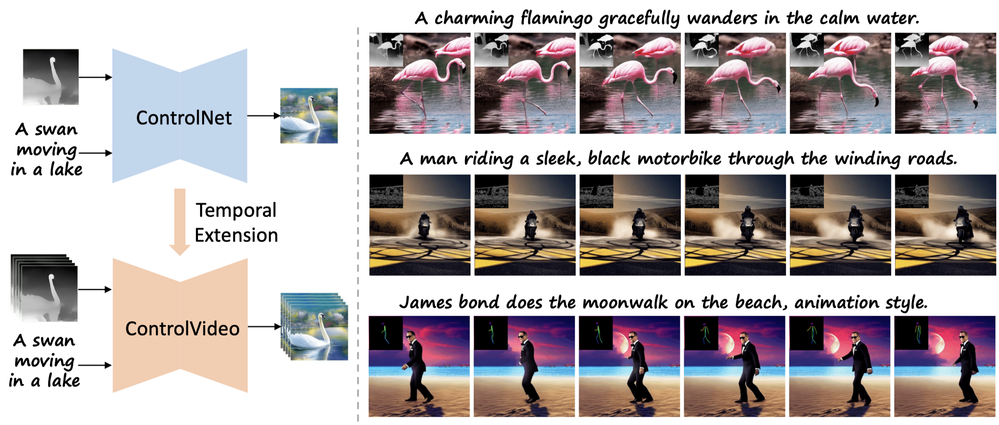 
<br>
<em>ControlVideo adapts ControlNet to the video counterpart without any finetuning, aiming to directly inherit its high-quality and consistent generation </em>
</p>

## News
* [07/16/2023] Add [HuggingFace demo](https://huggingface.co/spaces/Yabo/ControlVideo)!
* [07/11/2023] Support [ControlNet 1.1](https://github.com/lllyasviel/ControlNet-v1-1-nightly) based version! 
* [05/28/2023] Thank [chenxwh](https://github.com/chenxwh), add a [Replicate demo](https://replicate.com/cjwbw/controlvideo)!
* [05/25/2023] Code [ControlVideo](https://github.com/YBYBZhang/ControlVideo/) released!
* [05/23/2023] Paper [ControlVideo](https://arxiv.org/abs/2305.13077) released!

## Setup

### 1. Download Weights
All pre-trained weights are downloaded to `checkpoints/` directory, including the pre-trained weights of [Stable Diffusion v1.5](https://huggingface.co/runwayml/stable-diffusion-v1-5), ControlNet 1.0 conditioned on [canny edges](https://huggingface.co/lllyasviel/sd-controlnet-canny), [depth maps](https://huggingface.co/lllyasviel/sd-controlnet-depth), [human poses](https://huggingface.co/lllyasviel/sd-controlnet-openpose), and ControlNet 1.1 in [here](https://huggingface.co/lllyasviel). 
The `flownet.pkl` is the weights of [RIFE](https://github.com/megvii-research/ECCV2022-RIFE).
The final file tree likes:

```none
checkpoints
├── stable-diffusion-v1-5
├── sd-controlnet-canny
├── sd-controlnet-depth
├── sd-controlnet-openpose
├── ...
├── flownet.pkl
```
### 2. Requirements

```shell
conda create -n controlvideo python=3.10
conda activate controlvideo
pip install -r requirements.txt
```
Note: `xformers` is recommended to save memory and running time. `controlnet-aux` is updated to version 0.0.6.

## Inference

To perform text-to-video generation, just run this command in `inference.sh`:
```bash
python inference.py \
    --prompt "A striking mallard floats effortlessly on the sparkling pond." \
    --condition "depth" \
    --video_path "data/mallard-water.mp4" \
    --output_path "outputs/" \
    --video_length 15 \
    --smoother_steps 19 20 \
    --width 512 \
    --height 512 \
    --frame_rate 2 \
    --version v10 \
    # --is_long_video
```
where `--video_length` is the length of synthesized video, `--condition` represents the type of structure sequence,
`--smoother_steps` determines at which timesteps to perform smoothing, `--version` selects the version of ControlNet (e.g., `v10` or `v11`), and `--is_long_video` denotes whether to enable efficient long-video synthesis.

## Visualizations

### ControlVideo on depth maps

<table class="center">
<tr>
  <td width=30% align="center">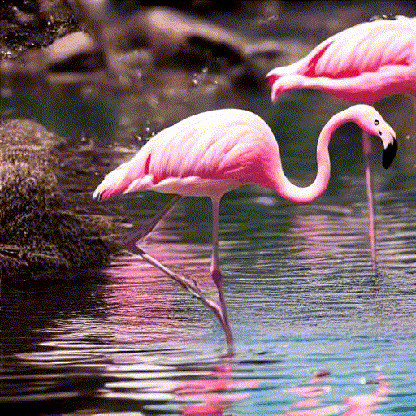</td>
	<td width=30% align="center"></td>
  <td width=30% align="center">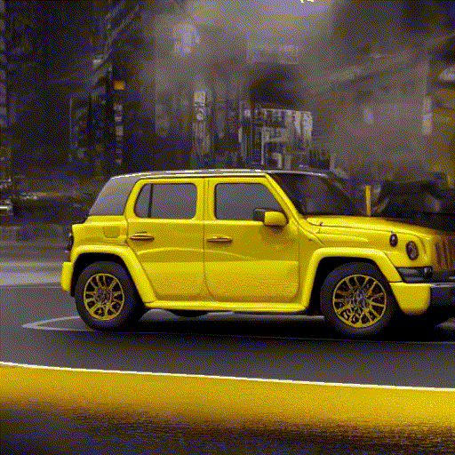</td>
</tr>
<tr>
  <td width=30% align="center">"A charming flamingo gracefully wanders in the calm and serene water, its delicate neck curving into an elegant shape."</td>
  <td width=30% align="center">"A striking mallard floats effortlessly on the sparkling pond."</td>
  <td width=30% align="center">"A gigantic yellow jeep slowly turns on a wide, smooth road in the city."</td>
</tr>
 <tr>
	<td width=30% align="center">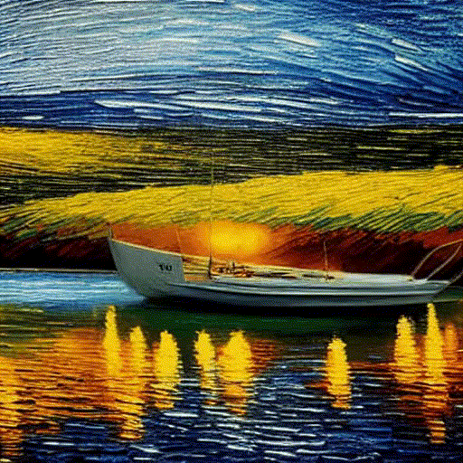</td>
  <td width=30% align="center">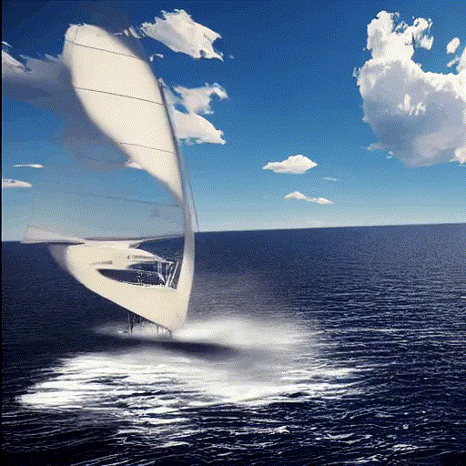</td>
	<td width=30% align="center">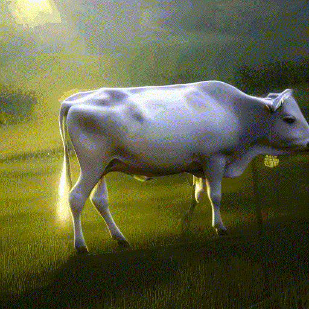</td>
</tr>
<tr>
  <td width=30% align="center">"A sleek boat glides effortlessly through the shimmering river, van gogh style."</td>
  <td width=30% align="center">"A majestic sailing boat cruises along the vast, azure sea."</td>
  <td width=30% align="center">"A contented cow ambles across the dewy, verdant pasture."</td>
</tr>
</table>

### ControlVideo on canny edges

<table class="center">
<tr>
  <td width=30% align="center">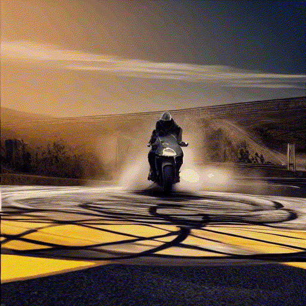</td>
  <td width=30% align="center">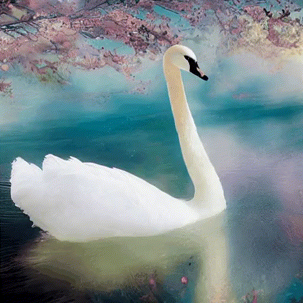</td>
	<td width=30% align="center">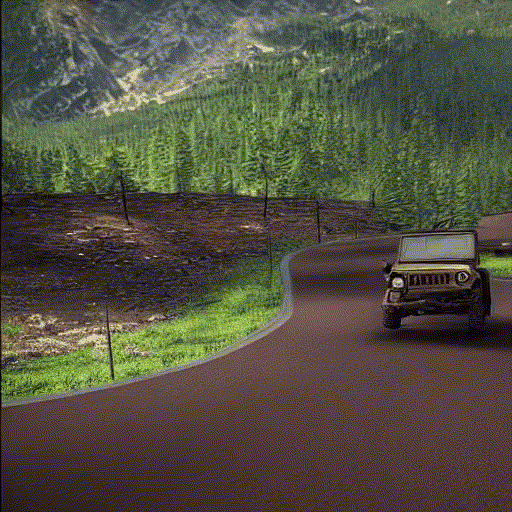</td>
</tr>
<tr>
  <td width=30% align="center">"A young man riding a sleek, black motorbike through the winding mountain roads."</td>
  <td width=30% align="center">"A white swan movingon the lake, cartoon style."</td>
  <td width=30% align="center">"A dusty old jeep was making its way down the winding forest road, creaking and groaning with each bump and turn."</td>
</tr>
 <tr>
  <td width=30% align="center">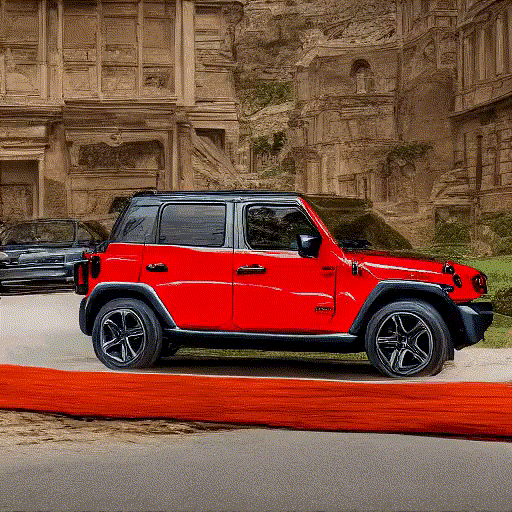</td>
  <td width=30% align="center">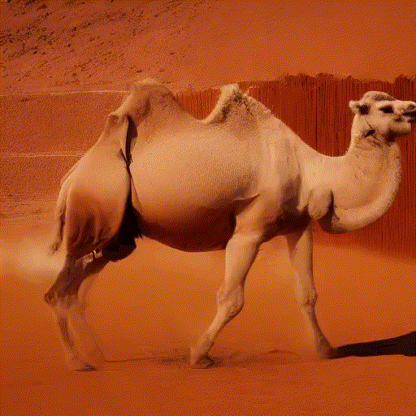</td>
	<td width=30% align="center">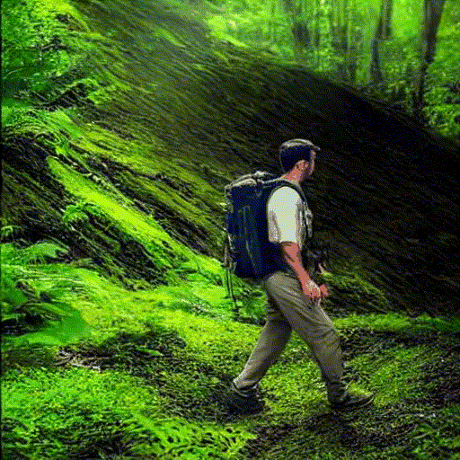</td>
</tr>
<tr>
  <td width=30% align="center">"A shiny red jeep smoothly turns on a narrow, winding road in the mountains."</td>
  <td width=30% align="center">"A majestic camel gracefully strides across the scorching desert sands."</td>
  <td width=30% align="center">"A fit man is leisurely hiking through a lush and verdant forest."</td>
</tr>
</table>


### ControlVideo on human poses

<table class="center">
<tr>
  <td width=25% align="center">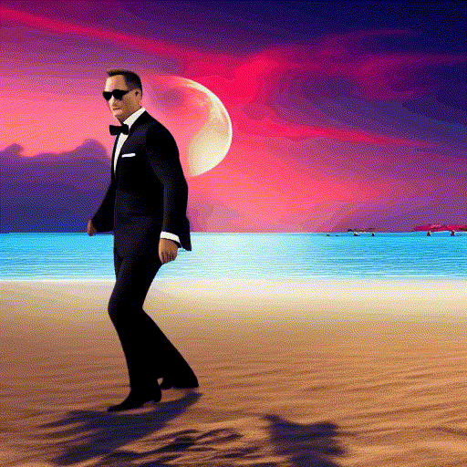</td>
  <td width=25% align="center">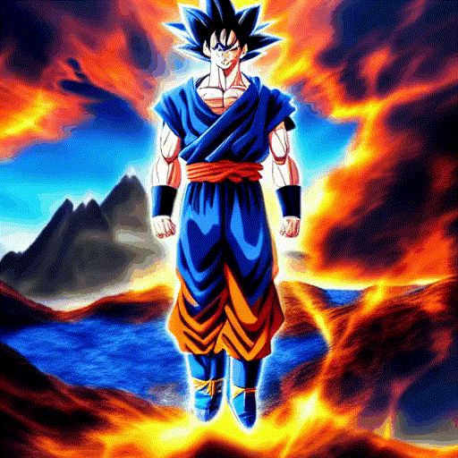</td>
	<td width=25% align="center">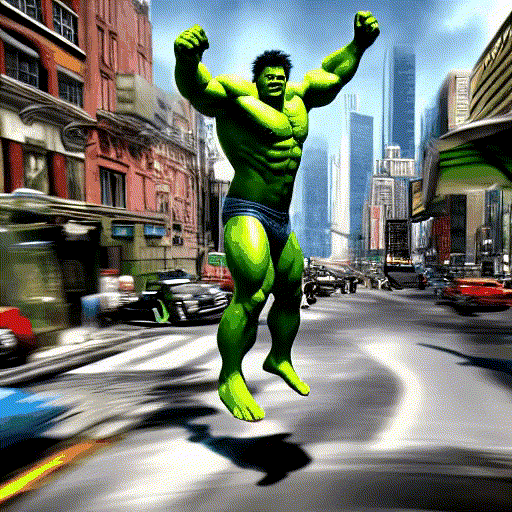</td>
  <td width=25% align="center"></td>
</tr>
<tr>
  <td width=25% align="center">"James bond moonwalk on the beach, animation style."</td>
  <td width=25% align="center">"Goku in a mountain range, surreal style."</td>
  <td width=25% align="center">"Hulk is jumping on the street, cartoon style."</td>
  <td width=25% align="center">"A robot dances on a road, animation style."</td>
</tr></table>

### Long video generation

<table class="center">
<tr>
  <td width=60% align="center"></td>
	<td width=40% align="center"></td>
</tr>
<tr>
  <td width=60% align="center">"A steamship on the ocean, at sunset, sketch style."</td>
  <td width=40% align="center">"Hulk is dancing on the beach, cartoon style."</td>
</tr>
</table>

## Citation
If you make use of our work, please cite our paper.
```bibtex
@article{zhang2023controlvideo,
  title={ControlVideo: Training-free Controllable Text-to-Video Generation},
  author={Zhang, Yabo and Wei, Yuxiang and Jiang, Dongsheng and Zhang, Xiaopeng and Zuo, Wangmeng and Tian, Qi},
  journal={arXiv preprint arXiv:2305.13077},
  year={2023}
}
```

## Acknowledgement
This work repository borrows heavily from [Diffusers](https://github.com/huggingface/diffusers), [ControlNet](https://github.com/lllyasviel/ControlNet), [Tune-A-Video](https://github.com/showlab/Tune-A-Video), and [RIFE](https://github.com/megvii-research/ECCV2022-RIFE).
The code of HuggingFace demo borrows from [fffiloni/ControlVideo](https://huggingface.co/spaces/fffiloni/ControlVideo).
Thanks for their contributions!

There are also many interesting works on video generation: [Tune-A-Video](https://github.com/showlab/Tune-A-Video), [Text2Video-Zero](https://github.com/Picsart-AI-Research/Text2Video-Zero), [Follow-Your-Pose](https://github.com/mayuelala/FollowYourPose), [Control-A-Video](https://github.com/Weifeng-Chen/control-a-video), et al.
